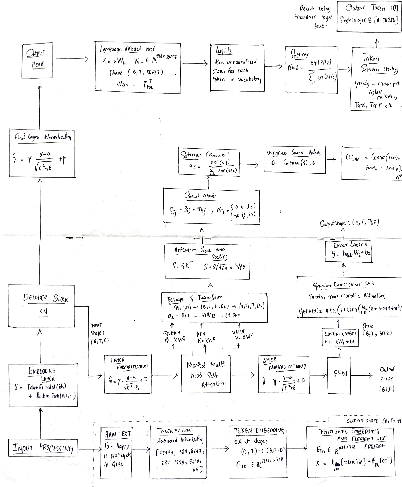

# GPT-2 Transformer Implementation


### Transformer Architecture Deep-Dive

> **Transform text into intelligent predictions using state-of-the-art attention mechanisms**

Understanding and implementing the GPT-2 decoder-only transformer architecture from scratch with comprehensive theory, code, and visualizations.

---

## Features

| Feature                     | Description                                |
| --------------------------- | ------------------------------------------ |
| **Deep Theory Guide**       | Comprehensive mathematical foundations     |
| **Code Implementation**     | PyTorch modules with detailed explanations |
| **Control Flow Diagrams**   | LaTeX-rendered architecture visualizations |
| **Worked Examples**         | Step-by-step numerical walkthroughs        |
| **Attention Visualization** | Heatmaps of attention patterns             |

---

## Architecture

```
┌─────────────────────────────────────────────────────────────┐
│                      GPT-2 ARCHITECTURE                      │
├─────────────────────────────────────────────────────────────┤
│  Input Text → BPE Tokenizer → Token IDs                     │
│       ↓                                                      │
│  Token Embedding + Positional Embedding                      │
│       ↓                                                      │
│  ┌─────────────────────────────────────┐                    │
│  │     DECODER BLOCK (×N layers)       │                    │
│  │  ┌─────────────────────────────┐    │                    │
│  │  │ LayerNorm → Multi-Head      │────┼─→ Residual        │
│  │  │ Masked Self-Attention       │    │                    │
│  │  └─────────────────────────────┘    │                    │
│  │  ┌─────────────────────────────┐    │                    │
│  │  │ LayerNorm → FFN (GELU)      │────┼─→ Residual        │
│  │  └─────────────────────────────┘    │                    │
│  └─────────────────────────────────────┘                    │
│       ↓                                                      │
│  Final LayerNorm → LM Head → Softmax → Next Token           │
└─────────────────────────────────────────────────────────────┘
```

---

## Getting Started

### Prerequisites

```bash
pip install torch matplotlib numpy
```

### Quick Example

```python
import torch
from multihead_attention import CausalSelfAttention

# Initialize GPT-2 style attention
csa = CausalSelfAttention(d_model=768, num_heads=12, max_seq_len=1024)

# Forward pass
x = torch.randn(2, 512, 768)  # (batch, seq_len, d_model)
output = csa(x)
print(f"Output shape: {output.shape}")  # [2, 512, 768]
```

---

## Performance

| Model        | Layers | d_model | Heads | Parameters |
| ------------ | ------ | ------- | ----- | ---------- |
| GPT-2 Small  | 12     | 768     | 12    | 117M       |
| GPT-2 Medium | 24     | 1024    | 16    | 345M       |
| GPT-2 Large  | 36     | 1280    | 20    | 774M       |
| GPT-2 XL     | 48     | 1600    | 25    | 1.5B       |

---

## Project Structure

```
GPT/
├── DEEP_THEORY_GUIDE.md          # Comprehensive theory documentation
├── HOW_TO_CODE_GUIDE.md          # Step-by-step coding guide
├── CONTROL_FLOW_DIAGRAM.tex      # LaTeX architecture diagrams
├── WORKED_EXAMPLE.md             # Numerical walkthrough example
├── multihead_attention.py        # Multi-Head Attention implementation
├── positional_encoding.py        # Positional Encoding implementation
└── README.md                     # This file
```

---

## Core Implementations

### 1. Multi-Head Attention (`multihead_attention.py`)

```python
from multihead_attention import MultiHeadAttention, CausalSelfAttention

# Standard Multi-Head Attention
mha = MultiHeadAttention(d_model=512, num_heads=8)
output = mha(query, key, value, mask=mask)

# GPT-2 Style Causal Self-Attention
csa = CausalSelfAttention(d_model=512, num_heads=8, max_seq_len=1024)
output = csa(x)
```

### 2. Positional Encoding (`positional_encoding.py`)

```python
from positional_encoding import PositionalEncoding, LearnedPositionalEncoding

# Sinusoidal (Original Transformer)
pe = PositionalEncoding(d_model=512, max_len=5000)

# Learned (GPT-2 Style)
lpe = LearnedPositionalEncoding(d_model=512, max_len=1024)
```

---

## Attention Mechanism

The core attention formula:

```
Attention(Q, K, V) = softmax(Q · K^T / √d_k) · V
```

| Symbol   | Meaning                               |
| -------- | ------------------------------------- |
| **Q**    | Query - What we're looking for        |
| **K**    | Key - What's available to match       |
| **V**    | Value - The actual information        |
| **√d_k** | Scaling factor for gradient stability |

---

## Architecture Diagram



---

## References

- [Attention is All You Need (Vaswani et al., 2017)](https://arxiv.org/abs/1706.03762)
- [GPT-2: Language Models are Unsupervised Multitask Learners](https://cdn.openai.com/better-language-models/language_models_are_unsupervised_multitask_learners.pdf)
- [The Illustrated Transformer](https://jalammar.github.io/illustrated-transformer/)
- [The Illustrated GPT-2](https://jalammar.github.io/illustrated-gpt2/)
- [Hugging Face Transformers](https://huggingface.co/docs/transformers)
- [PyTorch nn.Transformer](https://pytorch.org/docs/stable/generated/torch.nn.Transformer.html)
- [OpenAI GPT-2 GitHub](https://github.com/openai/gpt-2)

---

## License

This project is for educational purposes.

Built as part of **GDSC AIML learning track**
